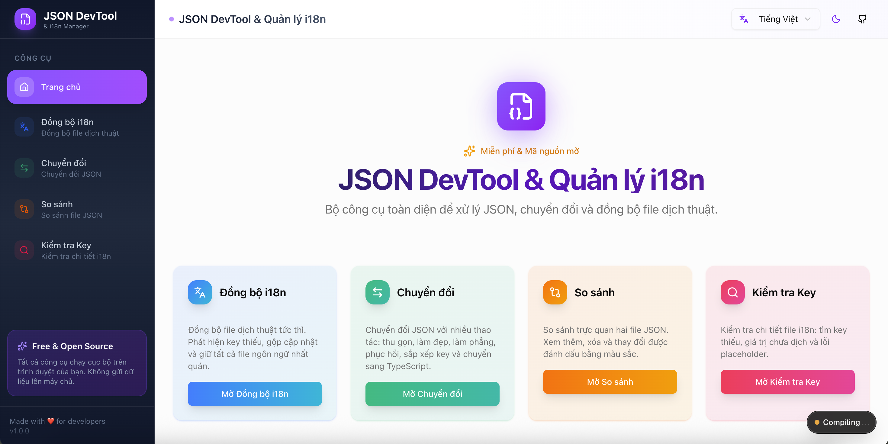

# JSON DevTool & i18n Manager

A powerful, all-in-one toolkit for JSON manipulation, transformation, and translation file synchronization. Built with Next.js, Tailwind CSS, and shadcn/ui.



---

# Features

## i18n Sync

Synchronize translation files instantly. Detect missing keys, merge updates, and keep all language files consistent.

- Add missing keys from source to target
- Remove extra keys not in source (optional)
- Sort keys alphabetically (optional)
- Preview changes before applying
- Preserve existing translations

## JSON Transform

Transform JSON with various operations: minify, beautify, flatten, unflatten, sort keys, and convert to TypeScript interfaces.

- **Beautify**: Format JSON with proper indentation
- **Minify**: Compress JSON by removing whitespace
- **Flatten**: Convert nested objects to dot notation
- **Unflatten**: Restore nested structure from dot notation
- **Sort Keys**: Alphabetically sort all object keys (recursive)
- **To TypeScript**: Generate TypeScript interface from JSON
- **Escape/Unescape**: Handle special characters

## Diff Viewer

Compare two JSON files visually. See additions, deletions, and changes highlighted with color-coded diff view.

- Side-by-side comparison
- Color-coded differences (added, removed, changed, unchanged)
- Statistics summary
- Filter by change type

## Key Compare & Deep Audit

Deep audit i18n files: find missing keys, untranslated values, and placeholder mismatches.

- Detect missing translation keys
- Find untranslated values (same as source)
- Identify placeholder mismatches (e.g., `{{name}}` vs `{{user}}`)
- Export audit results

---

# Tech Stack

- **Framework**: [Next.js 15](https://nextjs.org/) with App Router
- **Styling**: [Tailwind CSS v4](https://tailwindcss.com/)
- **Components**: [shadcn/ui](https://ui.shadcn.com/) (New York style)
- **Icons**: [Lucide React](https://lucide.dev/)
- **Notifications**: [Sonner](https://sonner.emilkowal.ski/)
- **Language**: TypeScript

---

# Internationalization

The app itself supports multiple languages:

- 🇺🇸 English
- 🇻🇳 Vietnamese

Switch languages using the language selector in the header.

---

# Getting Started

## Prerequisites

- Node.js 20+
- yarn (recommended)

## Installation

```bash
# Clone the repository
git clone https://github.com/ngoc2003/Json-Tool-for-Developer.git
cd Json-Tool-for-Developer

# Install dependencies
yarn install

# Run development server
yarn dev
```

Open [http://localhost:3000](http://localhost:3000) with your browser.

### Build for Production

```bash
yarn build
yarn dev
```

## 📁 Project Structure

```
json-supporter/
├── app/                    # Next.js App Router pages
│   ├── page.tsx           # Homepage (redirects to dashboard)
│   ├── home-client.tsx    # Dashboard client component
│   ├── i18n-sync/         # i18n Sync feature
│   ├── transform/         # JSON Transform feature
│   ├── diff-viewer/       # Diff Viewer feature
│   └── key-compare/       # Key Compare feature
├── components/
│   ├── features/          # Feature-specific components
│   ├── shared/            # Shared components (Header, Sidebar, etc.)
│   └── ui/                # shadcn/ui components
├── contexts/              # React contexts (Language, Theme)
├── hooks/                 # Custom React hooks
├── locales/               # Translation files (en.json, vi.json)
├── utils/                 # Utility functions
└── public/                # Static assets
```

## 🔒 Privacy

**All processing happens locally in your browser.** No data is sent to any server. Your JSON files and translations remain completely private.

## 📝 License

MIT License - feel free to use this project for personal or commercial purposes.

## 🤝 Contributing

Contributions are welcome! Please feel free to submit a Pull Request.

1. Fork the repository
2. Create your feature branch (`git checkout -b feature/amazing-feature`)
3. Commit your changes (`git commit -m 'Add some amazing feature'`)
4. Push to the branch (`git push origin feature/amazing-feature`)
5. Open a Pull Request

## 📧 Feedback

Have suggestions or found a bug? Use the feedback button in the app or open an issue on GitHub.

---

Built with ❤️ by [BNgoc](https://github.com/yourusername)
